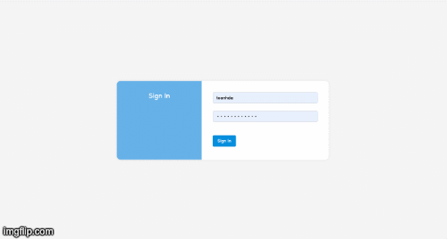

Template web admin
=== 
    

- [Template web admin](#template-web-admin)
  - [1. Overview](#1-overview)
  - [2. Technical stack](#2-technical-stack)
    - [2.1 Front-end](#21-front-end)
    - [2.2 Back-end](#22-back-end)
      - [3.1.1 Requirements](#311-requirements)
      - [3.1.2 Start](#312-start)
    - [3.2 Back-end](#32-back-end)
      - [3.2.1 Java](#321-java)
        - [Requirements](#requirements)
        - [Build](#build)
      - [3.2.2 JS](#322-js)
        - [Swagger ExpressJS](#swagger-expressjs)
        - [TypeJS](#typejs)
  - [4. Example](#4-example)
    - [4.1 UI](#41-ui)
  - [5. Authors](#5-authors)
  - [6. Versioning](#6-versioning)
  - [7. License](#7-license)
## 1. Overview

This is template can help you build project admin so fast

## 2. Technical stack

### 2.1 Front-end

ReactJs

### 2.2 Back-end

 We have multiple option:
 - Java
    - String boot
 - JS
    - Swagger + expressJS
    - TypeJS
 ## 3. Installation
 
 ### 3.1 Front-end

#### 3.1.1 Requirements

- Nodejs
- NPM

#### 3.1.2 Start

```shell
cd client
npm install
npm start
```

### 3.2 Back-end

#### 3.2.1 Java

##### Requirements

- Java 8


##### Build

```shell
cd server/java
mvn clean install
```

#### 3.2.2 JS

##### Swagger ExpressJS

```shell
cd server/js/swagger-expressjs
npm install
npm start
```

##### TypeJS

```shell
cd server/js/ts-graphql
npm install
NODE_ENV=production npm run build 
npm run start:env
```

## 4. Example

### 4.1 UI 



## 5. Authors

* **Toan HUYNH** - *VNG Employee*

## 6. Versioning

- The versioning scheme we use is SemVer.


## 7. License

This project is licensed under the [MIT License](./LICENSE.md)